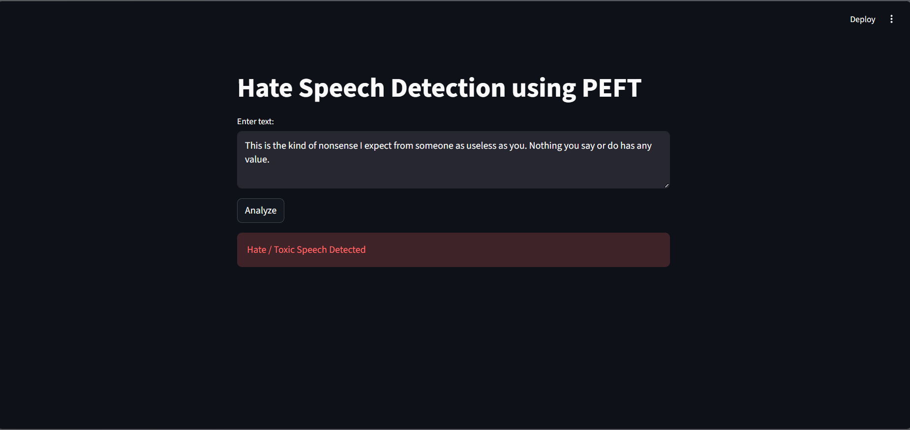

# Hate Speech Detection using Parameter-Efficient Fine-Tuning

 

## Overview
This project presents an efficient hate speech detection system using transformer-based Natural Language Processing techniques. A pre-trained DistilBERT model is fine-tuned using Parameter-Efficient Fine-Tuning (PEFT) with LoRA to classify text as toxic or non-toxic. The approach reduces computational cost while maintaining strong performance.

The trained model is deployed using Streamlit to provide an interactive interface for real-time text classification.

---

## Objectives
- Develop a hate speech detection model using transformer architectures  
- Reduce training cost using parameter-efficient fine-tuning techniques  
- Evaluate model performance using standard metrics  
- Deploy the model for real-time predictions  

---

## Methodology
1. Load and preprocess the Civil Comments dataset  
2. Convert toxicity scores into binary labels  
3. Fine-tune DistilBERT using LoRA (PEFT)  
4. Handle class imbalance using weighted loss  
5. Evaluate model using accuracy and F1-score  
6. Deploy the trained model using Streamlit  

---

## Technologies Used
- Python  
- PyTorch  
- Hugging Face Transformers  
- PEFT (LoRA)  
- Streamlit  
- Scikit-learn  

---

## Project Structure
peft-hate-speech-detection/  
│  
├── train.py  
├── app.py  
├── requirements.txt  
├── README.md  
└── .gitignore  

---

## Installation

Install dependencies:

`` pip install -r requirements.txt ``

---

## Training the Model

Run the training script:

`` python train.py  ``

The trained model will be saved in a local directory.

---

## Running the Application

Start the Streamlit app:

`` streamlit run app.py ``

Enter text in the interface to classify it as toxic or non-toxic.

---

## Results
The model demonstrates effective performance in detecting explicit toxic content. Parameter-Efficient Fine-Tuning significantly reduces the number of trainable parameters while maintaining competitive accuracy and F1-score.

---

## Limitations
- Difficulty in detecting sarcasm and implicit hate speech  
- Performance depends on dataset quality and balance  
- Limited generalization to multilingual content  

---

## Future Work
- Improve detection of implicit and contextual hate speech  
- Extend support to multiple languages  
- Compare with full fine-tuning approaches  
- Deploy the application on a cloud platform  

---

## Repository
https://github.com/Karangarg01/peft-hate-speech-detection

---

## Author
Karan Garg

---

## License
This project is intended for academic and research purposes.
